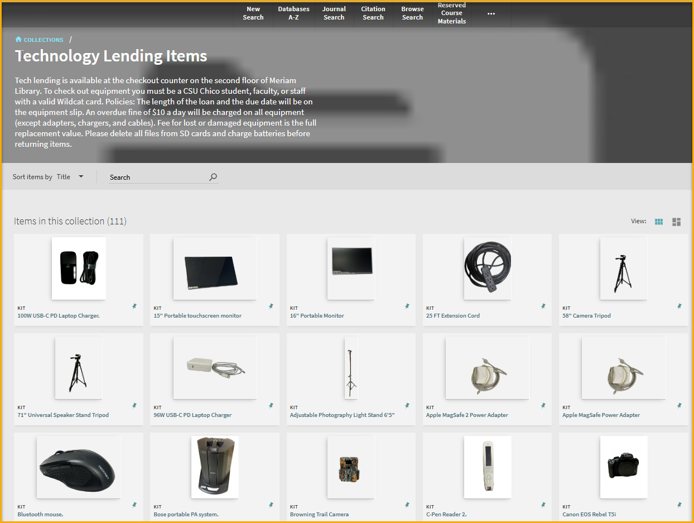

# Synchronization-of-ALMA-Collections-with-the-Library-Web-Page
ALMA Collections and Library Website Synchronization

The library website serves as a vital bridge between patrons and library services. Its primary role is to deliver clear, accurate, and visually appealing information that avoids confusion and improves communication efficiency. A well-designed site ensures students and faculty can easily access academic resources without contradiction or unnecessary barriers.

Most modern library websites are built with content management systems (CMS) such as Drupal or WordPress. CMS platforms offer convenience and efficiency, enabling libraries to update and manage content seamlessly.

Meanwhile, discovery interfaces such as Primo provide patrons with powerful access to library collections. Primo has expanded beyond the traditional OPAC role by offering ways to showcase curated collections, allowing users to explore items in a focused and structured manner. However, Primo VE’s interface is not as easily customizable as a CMS-based library website, especially when it comes to integrating navigation menus, branding, or other tailored user interface elements.

For example, our library maintains a collection in Alma called Tech Lending Items, which contains 112 loanable items for students and faculty. While Primo VE displays this collection and even supports thumbnails stored in MARC field 956, customizing the display within Primo to match our website’s design or navigation structure is challenging.

To provide a consistent patron experience, we decided to surface this collection directly on the library website. Rather than manually replicating the collection data—which would be inefficient and error-prone—we use the Alma Bib API to dynamically synchronize collection data. This allows us to display up-to-date item details (including titles, thumbnails, and metadata) within a CMS block or page.

This approach gives patrons the best of both worlds:

Seamless access to curated collections from Alma.
A fully integrated experience within the library website, with its familiar navigation menus, facets, and branding.

The implementation includes a demonstration block built with Bootstrap 5, which can easily be added to a PHP-based CMS, especially in customized modules. To improve performance and reduce latency from repeated API calls, we also recommend using caching solutions such as Redis, ensuring both efficiency and reliability.

By integrating Alma collections directly into the library website, we provide patrons with a more intuitive, consistent, and user-friendly interface for discovering and using library resources.

The code was located in github https://github.com/andytang2008/Synchronization-of-ALMA-Collections-with-the-Library-Web-Page. 

I hope it helps.

 

